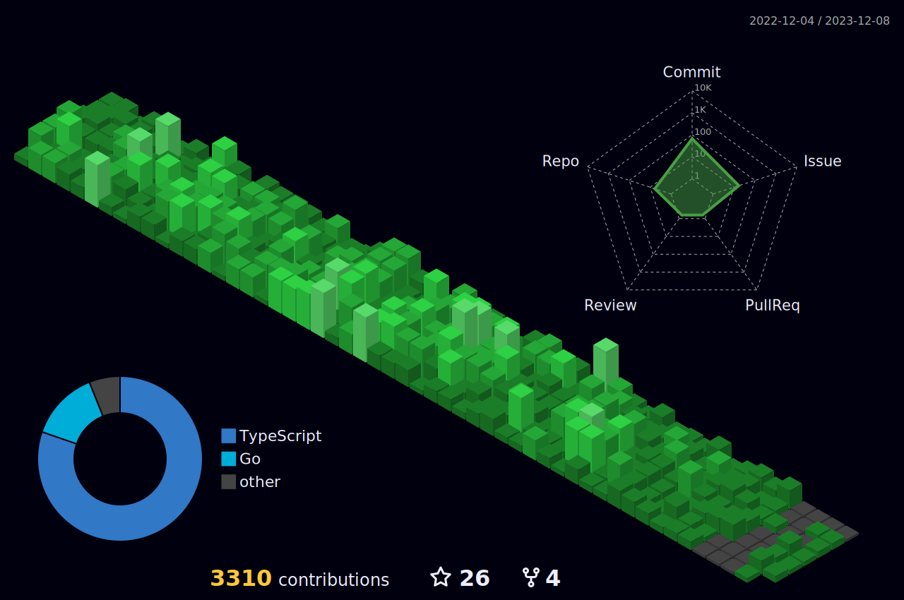

Hello World, I'm Victor Dantas
=====================================================================================================================================

A full stack Software Engineer passionate about creating innovative solutions. With expertise in TypeScript, Go, React, and more, I constantly seek to learn and apply new technologies. Currently pursuing a Software Engineering degree, I aim to excel in impactful projects. Let's connect!

* 🌍  I'm based in Brazil 🇧🇷
* 🖥️  See my portfolio at <a href="https://victordantas.dev/" target="_blank">my website</a>
* 🌐  You can contact me at [victordantasdeveloper@gmail.com](mailto:victordantasdeveloper@gmail.com)
* 🚀  I'm currently working on [Fox IoT](https://foxiot.com.br/)
* 🧠  I'm learning to [Go](https://go.dev/doc/)
* 🤝  I'm open to collaborating on any open-source project

---

## Skills:

  
   

---

Github Stats ⚡

